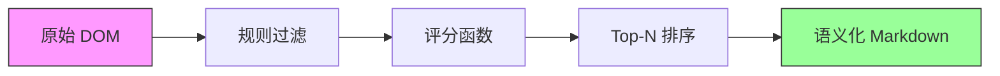

<p align="center">
  
</p>

<h1 align="center">🐒 Vibemonkey</h1>

<p align="center">
  <strong>AI-Powered Userscript Generator for Everyone</strong>
</p>

<p align="center">
  <em>像对话一样简单，让网页定制触手可及</em>
</p>

<p align="center">
  <a href="#-快速开始">快速开始</a> •
  <a href="#-特性">特性</a> •
  <a href="#%EF%B8%8F-技术架构">架构</a> •
  <a href="#-agent-function-api">API</a> •
  <a href="#-常见问题">FAQ</a> •
  <a href="#-贡献指南">贡献</a>
</p>

<p align="center">
  
  
  
  
  
  
</p>

---

## 🌟 这是什么？

**Vibemonkey** 是一款革命性的 Chrome 扩展程序，将 **Tampermonkey 脚本运行器** 的强大能力与 **AI 代码生成**的智慧完美融合。

> 🎯 **核心理念**：让完全不懂编程的用户也能拥有专属的网页脚本。你只需要描述需求，AI Agent 会像专业工程师一样，完成从研究、编写到测试的全过程。

<p align="center">
  
</p>

### ✨ 为什么选择 Vibemonkey？

| 传统方式 | Vibemonkey |
|---------|-----------|
| 🔧 需要学习 JavaScript/CSS | 💬 用自然语言描述需求 |
| 🔍 在社区中大海捞针 | 🤖 AI 自动搜索并适配脚本 |
| 🐛 调试报错一头雾水 | 🔄 自动迭代修复，无需干预 |
| 📝 手动维护脚本版本 | 🧠 智能记忆系统追踪演进 |
| ⚠️ 担心恶意代码风险 | 🛡️ QuickJS 沙箱安全执行 |

---

## 🚀 快速开始

### 安装

```bash
# 克隆仓库
git clone https://github.com/nowaywastaken/Vibemonkey.git
cd Vibemonkey

# 安装依赖
npm install

# 开发模式运行
npm run dev
```

### 加载扩展

1. 打开 Chrome，访问 `chrome://extensions`
2. 开启右上角的 **开发者模式**
3. 点击 **加载已解压的扩展程序**
4. 选择项目中的 `.output/chrome-mv3` 目录

### 配置

首次使用前，请在扩展的 **Options** 页面中配置：

- **DeepSeek API Key** - [获取 API Key](https://platform.deepseek.com/)
- **Mem0 API Key** (可选) - [获取 API Key](https://mem0.ai/)

---

## 🎯 特性

### 🤖 智能 AI Agent

- **自然语言交互**：用日常语言描述你的需求
- **流式响应**：实时查看 AI 的思考过程
- **迭代优化**：自动分析错误并修复脚本

### 🧠 Mem0 记忆系统

三层记忆架构，让 AI 越用越懂你：

```
┌─────────────────────────────────────────────────────────┐
│                    📚 Mem0 Memory System                │
├─────────────────────────────────────────────────────────┤
│  👤 用户偏好记忆     │  UI 风格、交互习惯、常用设置     │
├─────────────────────────────────────────────────────────┤
│  🌐 网站知识记忆     │  DOM 结构、API 端点、动态加载策略 │
├─────────────────────────────────────────────────────────┤
│  📜 脚本演进记忆     │  版本历史、修改原因、回归追踪     │
└─────────────────────────────────────────────────────────┘
```

### 🛡️ QuickJS 安全沙箱

> "影子执行" - 先预演，再行动

```
用户需求 → AI 生成脚本 → QuickJS 沙箱执行 → 捕获副作用 → 可视化预览 → 用户确认 → 真实执行
```

- 🔒 **完全隔离**：脚本在 WASM 虚拟机中运行
- 👁️ **可视化反馈**：高亮标记将被操作的元素
- ✅ **用户确认**：执行前清晰展示所有变更

### 🎯 DTPP 智能定位

**DOM-Tree Pruning Programming** - 88.28% 准确率的元素定位算法



### 🔌 社区脚本集成

一键导入，智能适配：

- **GreasyFork** - 全球最大的油猴脚本社区
- **OpenUserJS** - 开源脚本仓库
- **Userscript.Zone** - 脚本搜索引擎
- **GitHub/Gist** - 开发者脚本

---

## ⚙️ 技术架构

### 技术栈

| 层级 | 技术选型 | 说明 |
|-----|---------|------|
| **AI 引擎** | DeepSeek V3.2 | 通过 OpenRouter 接口调用 |
| **扩展框架** | WXT | 类似 Next.js 的浏览器扩展框架 |
| **记忆系统** | Mem0 | 云端长期记忆存储 |
| **安全沙箱** | QuickJS-emscripten | WASM 运行时隔离 |
| **脚本语言** | TypeScript | 编译与纠错对用户透明 |

### 系统架构

```
┌────────────────────────────────────────────────────────────────┐
│                        🐒 Vibemonkey                            │
├────────────────────────────────────────────────────────────────┤
│                                                                │
│  ┌──────────────┐    ┌──────────────┐    ┌──────────────┐     │
│  │   Popup UI   │◄──►│  Background  │◄──►│   Options    │     │
│  │   (React)    │    │   (SW/MV3)   │    │    Page      │     │
│  └──────────────┘    └──────┬───────┘    └──────────────┘     │
│                             │                                  │
│         ┌───────────────────┼───────────────────┐              │
│         ▼                   ▼                   ▼              │
│  ┌──────────────┐    ┌──────────────┐    ┌──────────────┐     │
│  │   Content    │    │   Offscreen  │    │   DeepSeek   │     │
│  │   Script     │    │   (QuickJS)  │    │     API      │     │
│  └──────────────┘    └──────────────┘    └──────────────┘     │
│         │                   ▲                   ▲              │
│         ▼                   │                   │              │
│  ┌──────────────┐           │            ┌──────────────┐     │
│  │   Web Page   │───────────┘            │    Mem0      │     │
│  │    (DOM)     │                        │    Cloud     │     │
│  └──────────────┘                        └──────────────┘     │
│                                                                │
└────────────────────────────────────────────────────────────────┘
```

### MV3 生存策略

Chrome Manifest V3 的 Service Worker 生命周期限制？我们有对策 👇

```typescript
// 🔥 Keep-Alive 心跳机制
const HEARTBEAT_INTERVAL_SECONDS = 20;

export function startKeepAlive() {
  chrome.alarms.create('vibemonkey-heartbeat', {
    periodInMinutes: HEARTBEAT_INTERVAL_SECONDS / 60
  });
}

chrome.alarms.onAlarm.addListener((alarm) => {
  if (alarm.name === 'vibemonkey-heartbeat') {
    console.log('💓 Vibemonkey: Heartbeat');
    void chrome.runtime.getPlatformInfo();
  }
});
```

**三重保障**：
1. ⏰ **定期唤醒** - Alarms API 每 20 秒心跳
2. 💾 **状态持久化** - 关键状态保存到 `browser.storage`
3. 🔄 **任务恢复** - 重启后无缝继续工作

### 通信架构

```typescript
// 🔐 类型安全的消息系统
type AgentMessage = 
  | { type: 'STREAM_TOKEN'; payload: string }
  | { type: 'STATUS_CHANGE'; payload: 'thinking' | 'writing' | 'testing' }
  | { type: 'DTPP_RESULT'; payload: ElementCandidate[] }
  | { type: 'SCRIPT_READY'; payload: { id: string; code: string } };
```

| 通信方向 | 技术实现 | 用途 |
|---------|---------|------|
| SW ↔ Popup | `chrome.runtime.connect` | 长连接流式输出 |
| SW ↔ Content | `tabs.sendMessage` | DOM 分析与脚本注入 |
| SW ↔ Offscreen | `runtime.sendMessage` | QuickJS 沙箱执行 |

---

## 📡 Agent Function API

<details>
<summary><b>🔍 网页分析 Functions</b></summary>

```typescript
// 获取 DOM 树
function getDOMTree(options: { 
  maxDepth?: number; 
  includeHidden?: boolean 
}): Promise<DOMNode[]>

// DTPP 智能元素定位
function findElements(query: { 
  keywords: string[]; 
  weights?: Record<string, number>; 
  topN?: number 
}): Promise<ElementCandidate[]>

// 元素详细检查
function inspectElement(selector: string): Promise<{
  html: string;
  computedStyles: Record<string, string>;
  boundingRect: DOMRect;
  eventListeners: string[];
}>

// 网络请求日志
function getNetworkLogs(filter?: { 
  type?: 'xhr' | 'fetch' | 'script' | 'all';
  urlPattern?: string 
}): Promise<NetworkLogEntry[]>
```

</details>

<details>
<summary><b>📜 脚本管理 Functions</b></summary>

```typescript
// 创建脚本
function createScript(script: {
  name: string;
  description: string;
  matchUrls: string[];
  code: string;
  enabled?: boolean;
}): Promise<{ scriptId: string; compileResult: CompileResult }>

// 更新脚本
function updateScript(
  scriptId: string, 
  updates: Partial<Script>
): Promise<{ compileResult: CompileResult }>

// 版本回滚
function rollbackScript(
  scriptId: string, 
  versionId: string
): Promise<void>

// 冲突检测
function detectConflicts(newScript: {
  matchUrls: string[];
  code: string;
}): Promise<Conflict[]>
```

</details>

<details>
<summary><b>🧪 脚本测试 Functions</b></summary>

```typescript
// 编译脚本
function compileScript(code: string): Promise<CompileResult>

// 沙箱测试
function testScript(
  code: string, 
  timeout?: number
): Promise<TestResult>

// 执行脚本
function executeScript(scriptId: string): Promise<ExecutionResult>
```

</details>

<details>
<summary><b>🌐 社区脚本 Functions</b></summary>

```typescript
// 搜索社区脚本
function searchCommunityScripts(query: {
  keyword: string;
  source?: 'greasyfork' | 'openuserjs' | 'github' | 'all';
  limit?: number;
}): Promise<CommunityScript[]>

// 导入并适配脚本
function importCommunityScript(
  url: string, 
  autoAdapt?: boolean
): Promise<{ scriptId: string }>
```

</details>

<details>
<summary><b>🧠 记忆系统 Functions</b></summary>

```typescript
// 添加记忆
function addMemory(memory: {
  type: 'user_preference' | 'site_knowledge' | 'script_evolution';
  domain?: string;
  content: string;
}): Promise<{ memoryId: string }>

// 搜索记忆
function searchMemory(query: {
  text: string;
  type?: MemoryType;
  domain?: string;
}): Promise<Memory[]>

// 脚本演进追踪
function getScriptEvolution(scriptId: string): Promise<{
  oldMemory: Memory;
  newMemory: Memory;
  diff: MemoryDiff;
}>
```

</details>

---

## 🖥️ 用户界面

### Popup 界面

```
┌─────────────────────────────────────┐
│  🐒 Vibemonkey          ⚙️ Status  │
├─────────────────────────────────────┤
│  📍 当前: example.com               │
│  🤖 状态: 思考中...                  │
│  📊 Token: 1,234 / 10,000           │
├─────────────────────────────────────┤
│  ✅ 激活的脚本 (3)                   │
│  ├─ 去广告脚本     example.com      │
│  ├─ 夜间模式       *.example.com    │
│  └─ 自动翻译       *                │
├─────────────────────────────────────┤
│  💬 AI 消息                          │
│  ┌─────────────────────────────────┐│
│  │ 我发现这个页面使用了动态加载...  ││
│  │ 正在生成一个基于 MutationObserver││
│  │ 的脚本来处理新加载的元素...       ││
│  └─────────────────────────────────┘│
├─────────────────────────────────────┤
│  📝 输入你的需求...           [发送] │
└─────────────────────────────────────┘
```

---

## 🛠️ 本地开发

### 环境要求

- Node.js >= 18
- npm >= 9
- Chrome >= 88 (支持 MV3)

### 开发命令

```bash
# 开发模式 (热重载)
npm run dev

# 构建生产版本
npm run build

# 类型检查
npm run typecheck

# 代码格式化
npm run format
```

### 目录结构

```
vibemonkey/
├── entrypoints/           # 扩展入口点
│   ├── background.ts      # Service Worker
│   ├── popup/             # Popup UI
│   ├── options/           # Options 页面
│   └── content.ts         # Content Script
├── lib/                   # 核心库
│   ├── agent/             # AI Agent 逻辑
│   ├── deepseek.ts        # DeepSeek API 客户端
│   ├── mem0.ts            # Mem0 记忆系统
│   └── sandbox/           # QuickJS 沙箱
├── components/            # UI 组件
├── assets/                # 静态资源
└── wxt.config.ts          # WXT 配置
```

---

## ❓ 常见问题

<details>
<summary><b>Q: 脚本生成需要多长时间？</b></summary>

A: 通常 10-30 秒，取决于需求复杂度。复杂脚本可能需要多轮迭代。

</details>

<details>
<summary><b>Q: 需要付费吗？</b></summary>

A: Vibemonkey 本身免费开源。但使用 DeepSeek API 需要付费（非常便宜）。Mem0 有免费额度。

</details>

<details>
<summary><b>Q: 支持哪些浏览器？</b></summary>

A: 目前仅支持 Chrome（基于 MV3）。Firefox 支持正在路上。

</details>

<details>
<summary><b>Q: 如何保证脚本安全？</b></summary>

A: 
1. **QuickJS 沙箱** - 所有脚本先在隔离环境测试
2. **影子执行** - 执行前可视化预览所有操作
3. **用户确认** - 重要操作需用户明确同意

</details>

<details>
<summary><b>Q: 脚本可以做什么？</b></summary>

A: 几乎任何网页定制！常见用例：
- 🚫 去除广告和弹窗
- 🎨 修改页面样式/夜间模式
- ⚡ 自动化重复操作
- 📥 下载受保护的内容
- 🔧 修复网站 bug
- ➕ 添加新功能

</details>

---

## 🤝 贡献指南

欢迎所有形式的贡献！

### 贡献方式

1. 🐛 **报告 Bug** - 使用 Issue 模板描述问题
2. 💡 **提出建议** - Feature Request 
3. 📖 **改进文档** - 修正错误或补充说明
4. 🔧 **提交代码** - Fork → Branch → PR

### 开发流程

```bash
# 1. Fork 并克隆仓库
git clone https://github.com/YOUR_NAME/Vibemonkey.git

# 2. 创建功能分支
git checkout -b feature/amazing-feature

# 3. 提交更改
git commit -m 'feat: add amazing feature'

# 4. 推送并创建 PR
git push origin feature/amazing-feature
```

### Commit 规范

```
feat: 新功能
fix: 修复 bug
docs: 文档更新
style: 代码格式
refactor: 重构
test: 测试相关
chore: 构建/工具
```

---

## 📜 许可证

[MIT License](LICENSE) © 2024 Vibemonkey Contributors

---

<p align="center">
  <sub>Made with ❤️ by developers, for everyone</sub>
</p>

<p align="center">
  <a href="https://github.com/nowaywastaken/Vibemonkey/stargazers">⭐ Star us on GitHub</a> •
  <a href="https://twitter.com/vibemonkey">🐦 Follow on Twitter</a> •
  <a href="https://discord.gg/vibemonkey">💬 Join Discord</a>
</p>
